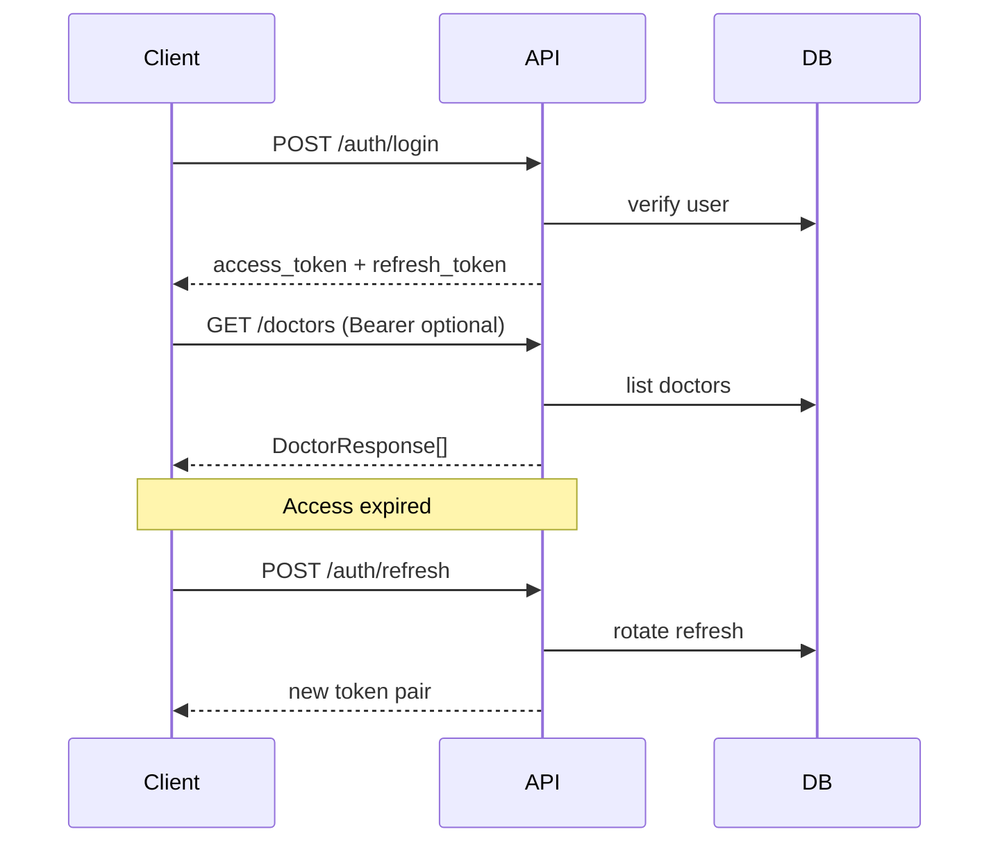

# Consilium API — справка для ИИ-агентов

Документ описывает бэкенд **Consilium** (стоматологическая клиника): REST API на FastAPI, SQLite, JWT. Используйте вместе с:

- `AI_CLIENT_MOBILE.md` — слой данных **мобильного приложения для пациентов**
- `AI_CLIENT_ADMIN.md` — слой данных **админ-панели**

## Назначение и границы

| Клиент | Роль пользователя | Что делает с API |
|--------|-------------------|------------------|
| Мобильное приложение | Обычный пользователь (`is_admin: false`) | Регистрация, вход, профиль; **только чтение** врачей и новостей |
| Админ-панель | Администратор (`is_admin: true`) | Вход; **полный CRUD** врачей и новостей + загрузка изображений |

Админов **нельзя** зарегистрировать через API — только скрипт `scripts/create_admin.py` на сервере.

## Базовые URL

| Среда | Base URL |
|-------|----------|
| Локальная разработка | `http://127.0.0.1:8000` |
| Docker (по умолчанию) | `http://<host>:8000` (порт из `API_PORT`) |

- Префикс API: **`/api/v1`**
- Health: `GET /health` → `{ "status": "ok" }`
- OpenAPI / Swagger: `GET /docs`, схема `GET /openapi.json`
- Статика загрузок: `GET /uploads/...` (корень сервера, **не** под `/api/v1`)

Полный URL картинки: `{BASE_URL}{path}`, где `path` — значение из ответа, например `/uploads/doctors/abc.jpg`.

## Стек и конфигурация

- Python 3.13+, FastAPI, SQLAlchemy, python-jose (JWT), bcrypt
- Переменные окружения (см. `.env.example`):
  - `SECRET_KEY` — подпись JWT (обязательно в production)
  - `ACCESS_TOKEN_EXPIRE_MINUTES` (по умолчанию 30)
  - `REFRESH_TOKEN_EXPIRE_DAYS` (по умолчанию 7)
  - `DATABASE_URL`, `UPLOADS_DIR` — в Docker
- CORS: `allow_origins=["*"]` — подходит для мобильных и веб-клиентов
- Макс. размер файла: **5 MB**; типы: `image/jpeg`, `image/png`, `image/webp`, `image/gif`

## Аутентификация

### Access token (JWT)

- Заголовок: `Authorization: Bearer <access_token>`
- Payload: `sub` = `user_id` (строка), `type` = `"access"`, `exp`
- Истёк или невалиден → **401** с `detail`

### Refresh token

- Не JWT: случайная строка (`secrets.token_urlsafe(32)`), хранится в БД как SHA-256 hash
- Выдаётся при `register` и `login` вместе с access token
- Обновление: `POST /api/v1/auth/refresh` — **ротация**: старый refresh отзывается, выдаётся новый

### Роли

- `GET /api/v1/auth/me` — любой авторизованный пользователь
- Мутации врачей/новостей — `get_current_admin`: нужен Bearer **и** `user.is_admin === true`, иначе **403** `"Admin access required"`

## Формат ошибок

FastAPI возвращает JSON:

```json
{ "detail": "строка или массив объектов валидации" }
```

Типичные коды:

| Код | Когда |
|-----|--------|
| 400 | Дубликат телефона, неверный тип/размер файла |
| 401 | Нет/неверный Bearer, неверный login, неверный refresh |
| 403 | Не админ на защищённом CRUD |
| 404 | Врач/новость не найдены |
| 422 | Ошибка валидации тела/query (Pydantic) |

## Модели данных (ответы API)

### User (`UserResponse`)

| Поле | Тип | Примечание |
|------|-----|------------|
| `id` | int | |
| `name` | string | |
| `phone` | string | Нормализуется: только цифры и `+` |
| `is_admin` | bool | В мобильном приложении обычно `false` |
| `created_at` | datetime (ISO 8601) | |

### Doctor (`DoctorResponse`)

| Поле | Тип | Обязательно |
|------|-----|-------------|
| `id` | int | |
| `avatar_url` | string \| null | URL пути, напр. `/uploads/doctors/....jpg` |
| `first_name` | string | да |
| `last_name` | string | да |
| `patronymic` | string \| null | отчество |
| `position` | string | должность |
| `description` | string \| null | текст/HTML на усмотрение клиента |
| `created_at`, `updated_at` | datetime | |

Отображаемое ФИО на клиенте: `{last_name} {first_name} {patronymic}` (патроним может быть пустым).

### News (`NewsResponse`)

| Поле | Тип | Обязательно |
|------|-----|-------------|
| `id` | int | |
| `title` | string | да |
| `description` | string | да, может быть длинным (Text в БД) |
| `image` | string \| null | путь к картинке, не `image_url` |
| `created_at`, `updated_at` | datetime | |

Список новостей отсортирован по **`created_at` DESC** (новые первые).

## Эндпоинты

### Auth — префикс `/api/v1/auth`

#### `POST /register` — без авторизации

Тело (`application/json`):

```json
{
  "name": "Иван Иванов",
  "phone": "+7 999 123-45-67",
  "password": "secret12"
}
```

Валидация: `name` 1–255; `phone` 10–20 символов, после нормализации ≥10 цифр/`+`; `password` 6–128.

Ответ **201** (`TokenResponse`):

```json
{
  "access_token": "...",
  "refresh_token": "...",
  "token_type": "bearer"
}
```

Ошибка **400**: `"User with this phone already exists"`.

#### `POST /login` — без авторизации

```json
{
  "phone": "+79991234567",
  "password": "secret12"
}
```

Ответ **200**: как `TokenResponse`. Ошибка **401**: `"Invalid phone or password"`.

#### `POST /refresh` — без Bearer

```json
{ "refresh_token": "<refresh>" }
```

Ответ **200** (`RefreshTokenResponse`): новая пара `access_token` + `refresh_token`. Ошибка **401**: `"Invalid or expired refresh token"`.

#### `GET /me` — Bearer обязателен

Ответ **200**: `UserResponse`.

### Doctors — префикс `/api/v1/doctors`

| Метод | Путь | Auth | Описание |
|-------|------|------|----------|
| GET | `/doctors?skip=0&limit=100` | — | Список |
| GET | `/doctors/{id}` | — | Один врач |
| POST | `/doctors` | Admin | multipart: создание + файл `avatar` |
| POST | `/doctors/json` | Admin | JSON: `DoctorCreate` |
| PUT | `/doctors/{id}` | Admin | multipart: частичное обновление |
| PUT | `/doctors/{id}/json` | Admin | JSON: `DoctorUpdate` (только переданные поля) |
| DELETE | `/doctors/{id}` | Admin | **204** без тела |

**Multipart POST/PUT** (поля form):

- Обязательные при создании: `first_name`, `last_name`, `position`
- Опционально: `patronymic`, `description`, `avatar_url`, файл `avatar`
- Если передан файл `avatar` с именем — `avatar_url` перезаписывается путём после `save_upload`

**JSON** (`DoctorCreate` / `DoctorUpdate`): те же поля, что в схемах Pydantic в `src/schemas/doctor.py`.

### News — префикс `/api/v1/news`

| Метод | Путь | Auth | Описание |
|-------|------|------|----------|
| GET | `/news?skip=0&limit=100` | — | Список, новые первые |
| GET | `/news/{id}` | — | Одна новость |
| POST | `/news` | Admin | multipart |
| POST | `/news/json` | Admin | JSON: `NewsCreate` |
| PUT | `/news/{id}` | Admin | multipart |
| PUT | `/news/{id}/json` | Admin | JSON: `NewsUpdate` |
| DELETE | `/news/{id}` | Admin | **204** |

**Multipart**: `title`, `description` обязательны при создании; опционально `image_url`, файл `image`.

**JSON**: поле картинки называется **`image`** (не `image_url`).

## Пагинация

Query-параметры `skip` (default 0) и `limit` (default 100) на списках врачей и новостей. Клиентам с бесконечной лентой увеличивайте `skip` шагами `limit`.

## Загрузка файлов (админ)

1. Предпочтительно для веб-админки: `multipart/form-data` на `POST/PUT` без суффикса `/json`.
2. Альтернатива: загрузить файл отдельно нельзя — только вместе с формой или указать готовый `avatar_url` / `image` в JSON (внешний URL или уже сохранённый путь `/uploads/...`).
3. После загрузки API возвращает относительный путь `/uploads/{doctors|news}/{uuid}.ext`.

## Диаграмма потоков



## Что не реализовано (не выдумывать)

- Запись на приём, услуги, цены, чат, push, оплата
- Сброс пароля, SMS-верификация, OAuth
- Logout/revoke всех refresh с клиента (можно только перестать хранить токены локально)
- Версионирование API кроме `/api/v1`
- Поиск/фильтры по врачам и новостям (только `skip`/`limit`)

## Проверка при разработке клиента

1. `GET /health` — сервер жив.
2. `GET /docs` — интерактивные запросы.
3. Админ: `uv run python scripts/create_admin.py`, затем `login` и CRUD с Bearer.
4. Картинка: `GET {BASE_URL}/uploads/doctors/<file>` после создания врача с `avatar`.

## Исходники (для уточнения поведения)

| Область | Путь |
|---------|------|
| Точка входа, CORS, static | `src/main.py` |
| Роуты | `src/routers/auth.py`, `doctors.py`, `news.py` |
| Схемы | `src/schemas/` |
| JWT / refresh | `src/auth/security.py` |
| Зависимости auth | `src/auth/dependencies.py` |
| Загрузки | `src/utils/uploads.py` |
